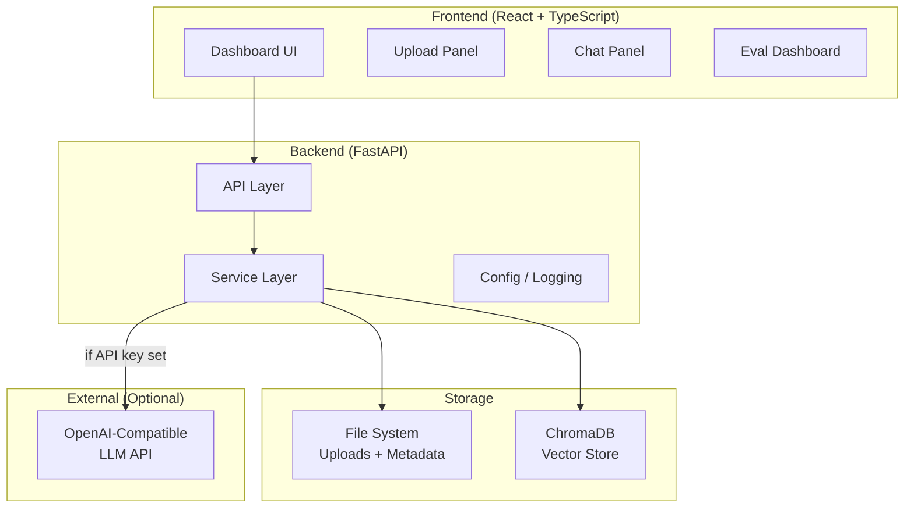
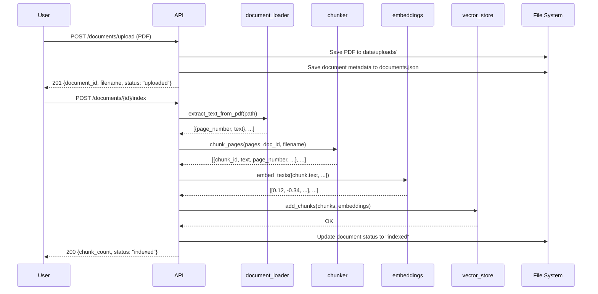
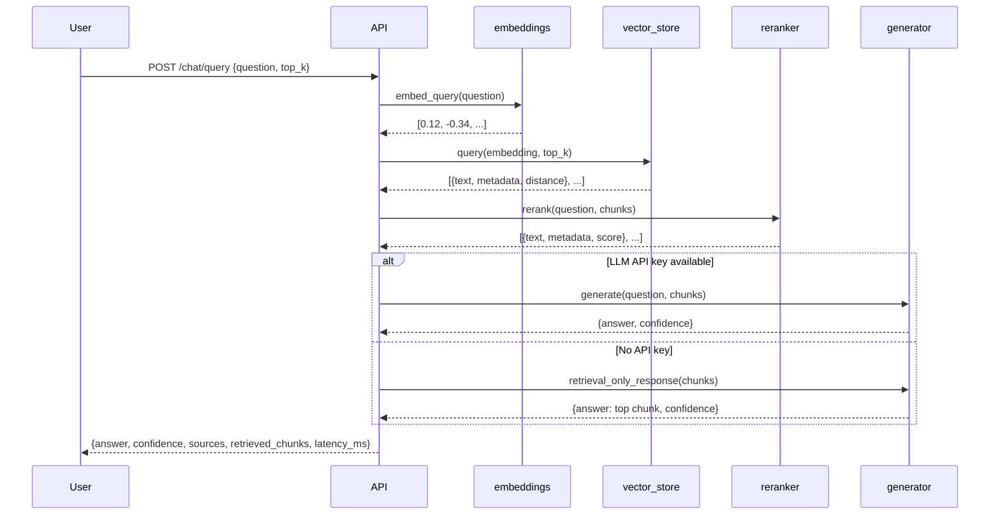
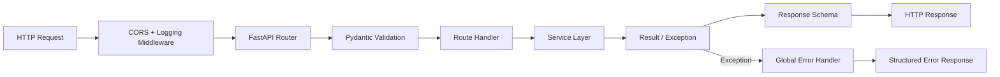

# ARCHITECTURE.md — Enterprise RAG Document Assistant

## System Architecture

The system is a full-stack web application composed of:
- A **FastAPI backend** that handles document ingestion, vector indexing, retrieval, and LLM-assisted generation.
- A **React frontend** that provides the user interface for document management, Q&A, and evaluation.
- A **ChromaDB vector store** (embedded, persistent) for storing and querying chunk embeddings.
- An optional **OpenAI-compatible LLM** for answer generation.

### High-Level Architecture



---

## Backend Module Responsibilities

### `app/api/` — Route Handlers

Thin handlers. Validate inputs, call exactly one service, return the response schema.

| Module | Responsibility |
|---|---|
| `health.py` | Health check and readiness probe |
| `documents.py` | Upload, list, delete, index documents |
| `chat.py` | Accept questions and return answers with citations |
| `evaluation.py` | Run and retrieve RAG evaluation results |

### `app/core/` — Infrastructure

| Module | Responsibility |
|---|---|
| `config.py` | All configuration via `pydantic-settings` and `.env` |
| `logging.py` | Structured logging setup (structlog or stdlib) |
| `errors.py` | Custom exceptions and global error handlers |

### `app/schemas/` — Pydantic Models

All request/response contracts for the API. These are the only types that cross the API boundary.

### `app/models/domain.py` — Domain Models

In-memory data structures and the document metadata repository (backed by a JSON file).

### `app/services/` — Business Logic

| Service | Responsibility |
|---|---|
| `document_loader.py` | Extract text from PDF files page by page |
| `chunker.py` | Split page text into overlapping chunks with metadata |
| `embeddings.py` | Generate dense vector embeddings using sentence-transformers |
| `vector_store.py` | Store and query chunk embeddings via ChromaDB |
| `retriever.py` | Orchestrate query embedding + vector store lookup |
| `reranker.py` | Reorder retrieved chunks by relevance score |
| `generator.py` | Generate answers from context (LLM or retrieval-only) |
| `evaluator.py` | Run evaluation metrics against a question set |

---

## Frontend Module Responsibilities

### `src/components/`

| Component | Responsibility |
|---|---|
| `Layout.tsx` | App shell with navigation sidebar |
| `UploadPanel.tsx` | Drag-and-drop PDF upload with progress |
| `DocumentList.tsx` | Table of uploaded documents with status badges |
| `ChatPanel.tsx` | Chat interface: input, message thread, loading state |
| `CitationCard.tsx` | Collapsible card showing document snippet + metadata |
| `EvaluationDashboard.tsx` | Metrics cards and per-question results table |

### `src/pages/`

| Page | Responsibility |
|---|---|
| `Dashboard.tsx` | Main page: Upload + Document List + Chat |
| `Evaluation.tsx` | Evaluation runner and results display |

### `src/services/api.ts`

Central module for all HTTP calls. Exports typed async functions for every API endpoint. Uses `VITE_API_URL` for the base URL.

### `src/types/index.ts`

All TypeScript interfaces matching the backend Pydantic schemas.

---

## Data Flow

### Document Ingestion Flow



### Query / RAG Flow



---

## API Request Flow



---

## Storage Strategy

### File System

```
backend/data/
├── uploads/                  # Raw PDF files, named by document_id
│   └── {document_id}.pdf
├── vector_store/             # ChromaDB persistence directory
│   └── chroma.sqlite3
│   └── ...
└── eval/
    └── questions.json        # Evaluation question set
```

Document metadata is stored in `backend/data/documents.json` as a simple JSON array. This is sufficient for local single-user use. A production system would use PostgreSQL or similar.

### Vector Store (ChromaDB)

- One collection: `rag_documents`
- Each chunk stored with its embedding and metadata fields:
  - `document_id`, `filename`, `page_number`, `character_start`, `character_end`
- Cosine similarity is used for retrieval (configured via `hnsw:space`).
- Data persists across restarts via `PersistentClient`.

---

## Design Tradeoffs

| Decision | Choice | Rationale |
|---|---|---|
| Vector DB | ChromaDB (embedded) | Zero infrastructure, works offline, persistent |
| Embeddings | sentence-transformers (local) | No API key required, fast inference, well-studied |
| Metadata store | JSON file | Eliminates database dependency for portfolio scope |
| LLM | OpenAI-compatible optional | Works without paid keys; pluggable |
| PDF extraction | pdfplumber | More reliable than pypdf for complex layouts |
| Frontend | React + Vite + Tailwind | Fast build, industry-standard stack |
| Python config | pydantic-settings | Type-safe, .env support, standard in FastAPI projects |
| Error handling | Global exception handler | Consistent JSON errors, no stack traces leaked |

See `DECISIONS.md` for full Architecture Decision Records.
