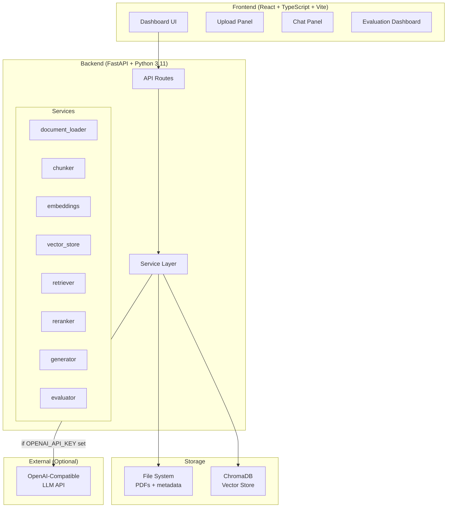

# Enterprise RAG Document Assistant


A production-quality **Retrieval-Augmented Generation (RAG)** system for document intelligence. Upload PDF documents, index them into a vector database, and ask natural language questions — receiving grounded answers with exact citations to the source document chunks.

Runs fully offline without any API key (retrieval-only mode). Plug in any OpenAI-compatible API to enable LLM-generated answers.

---

## What Makes This Different from Tutorial RAG

- Clean service-layer architecture — business logic separated from routes
- Works fully offline without any API key (retrieval-only mode)
- Formal RAG evaluation metrics (precision@k, recall@k, MRR)
- Docker + CI + tests included
- Configurable via environment variables, no hardcoded values

---

## Features

| Feature | Details |
|---|---|
| PDF Upload | Drag-and-drop, multi-file, size + type validation |
| Text Extraction | pdfplumber, page-level metadata preserved |
| Smart Chunking | Configurable size + overlap, character-level positions |
| Local Embeddings | sentence-transformers `all-MiniLM-L6-v2` (384d, no API key) |
| Vector Store | ChromaDB, persistent, cosine similarity |
| Semantic Retrieval | Top-k with score filtering |
| Score-Based Reranking | Clean extension point for cross-encoder reranking |
| LLM Generation | OpenAI-compatible API (optional) with anti-hallucination prompt |
| Retrieval-Only Fallback | Returns top chunks without any LLM if no API key is set |
| Source Citations | Document name, page number, text snippet, similarity score |
| RAG Evaluation | precision@k, recall@k, MRR, keyword coverage, latency |
| React Dashboard | Dark-mode UI with upload, doc list, chat, evaluation |
| Docker | Backend + frontend fully containerized |
| GitHub Actions CI | Backend tests + frontend build on every push |

---

## Tech Stack

**Backend:** Python 3.11 · FastAPI · Pydantic v2 · sentence-transformers · ChromaDB · pdfplumber · OpenAI SDK (optional) · structlog · pytest

**Frontend:** React 18 · TypeScript · Vite · Tailwind CSS · Axios · React Router

**DevOps:** Docker · docker-compose · Makefile · GitHub Actions

---

## Architecture



---

## RAG Pipeline

```
1. Upload PDF
        ↓
2. Extract text page-by-page (pdfplumber)
        ↓
3. Chunk text with overlap (configurable: 512 chars, 64 overlap)
        ↓
4. Embed chunks with sentence-transformers (384d cosine vectors)
        ↓
5. Store chunks + embeddings in ChromaDB
        ↓
   [Query time]
        ↓
6. Embed user question (same model)
        ↓
7. Retrieve top-k most similar chunks (ChromaDB cosine search)
        ↓
8. Rerank by score (extension point for cross-encoder)
        ↓
9. Generate answer from context (LLM or retrieval-only)
        ↓
10. Return answer + citations with page numbers + similarity scores
```

---

## Evaluation Methodology

The system evaluates retrieval quality against a predefined question set (`data/eval/questions.json`):

| Metric | Formula | What It Measures |
|---|---|---|
| **Precision@k** | relevant chunks in top-k / k | How much of what we retrieve is useful |
| **Recall@k** | relevant pages found / total relevant pages | How much of what's useful we actually retrieve |
| **MRR** | mean(1 / rank of first relevant) | How high does the first relevant result appear |
| **Keyword Coverage** | keywords found in retrieved text / total expected | Are key concepts present in retrieved chunks |
| **Avg Latency** | mean(query_end - query_start) | Retrieval speed |

---

## Local Setup (without Docker)

### Prerequisites
- Python 3.11+
- Node.js 20+

### Backend

```bash
cd backend
python -m venv .venv
source .venv/bin/activate        # Windows: .venv\Scripts\activate
pip install -r requirements.txt

mkdir -p data/uploads data/vector_store data/eval
cp data/eval/questions.json data/eval/questions.json  # already exists

cp ../.env.example .env           # edit if needed
uvicorn app.main:app --reload --port 8000
```

### Frontend

```bash
cd frontend
npm install
npm run dev
```

Open: http://localhost:5173

---

## Docker Setup

```bash
# Copy and configure environment
cp .env.example .env

# Build and start all services
docker-compose up --build

# Or using Makefile
make docker-up
```

| Service | URL |
|---|---|
| Frontend | http://localhost:5173 |
| Backend | http://localhost:8000 |
| API Docs | http://localhost:8000/docs |

Stop: `docker-compose down` or `make docker-down`

---

## API Examples

### Upload a document
```bash
curl -X POST http://localhost:8000/documents/upload \
  -F "files=@my_document.pdf"
```

### Index the uploaded document
```bash
curl -X POST http://localhost:8000/documents/{document_id}/index
```

### Ask a question
```bash
curl -X POST http://localhost:8000/chat/query \
  -H "Content-Type: application/json" \
  -d '{"question": "What are the main findings?", "top_k": 5}'
```

### Response
```json
{
  "answer": "The document describes three main findings...",
  "confidence": 0.87,
  "mode": "llm_generated",
  "latency_ms": 1243,
  "sources": [
    {
      "document_name": "report.pdf",
      "page_number": 3,
      "chunk_id": "abc123_p3_c0",
      "snippet": "The key finding is...",
      "score": 0.91
    }
  ],
  "retrieved_chunks": [...]
}
```

### List documents
```bash
curl http://localhost:8000/documents
```

### Run RAG evaluation
```bash
curl -X POST "http://localhost:8000/eval/run?top_k=5"
```

---

## Running Tests

```bash
cd backend
pytest tests/ -v
pytest tests/ -v --tb=short       # with tracebacks
pytest tests/ --cov=app           # with coverage
```

Tests that run without any API key or external service:
- `test_health.py` — API health endpoints
- `test_chunker.py` — text chunking logic (8 tests)
- `test_document_loader.py` — PDF extraction
- `test_retriever.py` — retrieval with mocked vector store
- `test_evaluator.py` — evaluation metric computation

---

## Environment Variables

Full reference in `.env.example`.

| Variable | Default | Description |
|---|---|---|
| `EMBEDDING_MODEL` | `all-MiniLM-L6-v2` | sentence-transformers model |
| `EMBEDDING_DIMENSION` | `384` | Must match the model output |
| `CHUNK_SIZE` | `512` | Characters per chunk |
| `CHUNK_OVERLAP` | `64` | Characters of overlap |
| `DEFAULT_TOP_K` | `5` | Chunks retrieved per query |
| `OPENAI_API_KEY` | _(empty)_ | Enables LLM generation if set |
| `OPENAI_BASE_URL` | `https://api.openai.com/v1` | Works with Groq, Ollama, Azure, etc. |
| `LLM_MODEL` | `gpt-4o-mini` | Model name for generation |
| `CHROMA_COLLECTION_NAME` | `rag_documents` | ChromaDB collection name |

### Adding an LLM API Key

1. Copy `.env.example` to `.env`
2. Set `OPENAI_API_KEY=sk-...`
3. Optionally change `LLM_MODEL` (e.g., `gpt-4o`, `llama3-70b-8192`)
4. For Groq: set `OPENAI_BASE_URL=https://api.groq.com/openai/v1`
5. For Ollama (local): set `OPENAI_BASE_URL=http://localhost:11434/v1` and `OPENAI_API_KEY=ollama`
6. Restart the backend

Without an API key, the system runs in retrieval-only mode: the top retrieved chunks are returned as the answer, with no hallucination risk.

---

## Limitations

1. **Scanned PDFs not supported** — OCR is required for image-only PDFs.
2. **Single-user only** — document metadata uses a JSON file; not safe for concurrent writes.
3. **Model cold start** — first query takes ~5s longer as the embedding model loads.
4. **LLM quality depends on context** — if the relevant text isn't retrieved, the answer will say so.

---

## Future Improvements

- [ ] Cross-encoder reranking (`cross-encoder/ms-marco-MiniLM-L-6-v2`)
- [ ] Streaming LLM responses (Server-Sent Events)
- [ ] Support DOCX, HTML, Markdown inputs
- [ ] Persistent metadata store (SQLite via SQLAlchemy)
- [ ] Qdrant as alternative vector store
- [ ] Query history / conversation memory
- [ ] Multi-document filtering in queries
- [ ] LLM provider selector in UI (OpenAI / Anthropic / Ollama)
- [ ] Prometheus metrics + OpenTelemetry tracing

---

## Skills Demonstrated

| Skill Area | Evidence |
|---|---|
| **RAG Architecture** | End-to-end pipeline from PDF to grounded answer |
| **LLM Application Engineering** | Anti-hallucination prompt design, retrieval-only fallback |
| **Vector Databases** | ChromaDB with cosine similarity, metadata filtering |
| **Embeddings** | Local sentence-transformers, configurable model |
| **Retrieval Evaluation** | precision@k, recall@k, MRR, keyword coverage |
| **FastAPI** | Async routes, Pydantic v2 schemas, dependency injection |
| **React + TypeScript** | Full dashboard with proper types, error/loading states |
| **Docker + DevOps** | Multi-stage builds, docker-compose, GitHub Actions CI |
| **Software Architecture** | Clean service layer, thin routes, ADRs, SOLID principles |
| **Production Mindset** | Structured logging, error handling, config via env vars |

---

## Screenshots

> TODO: Add screenshots after running the application.

Suggested screenshots for a strong GitHub README:
1. Dashboard with uploaded documents in the table
2. Chat interface with an answer and expanded citation cards
3. Evaluation dashboard with metric cards and per-question results
4. API docs (http://localhost:8000/docs) showing all endpoints

---

## GitHub Repository

**Description:** Production-quality RAG system: PDF upload → vector indexing → grounded Q&A with citations. FastAPI + ChromaDB + sentence-transformers + React + Docker.

**Topics:** `rag` `retrieval-augmented-generation` `fastapi` `chromadb` `sentence-transformers` `langchain-alternative` `vector-database` `embeddings` `llm` `react` `typescript` `docker` `mlops` `ai-engineering` `portfolio`
